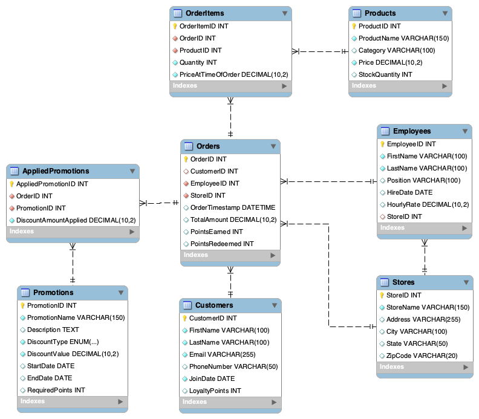

# Coffee Shop Management System

**Author:** Esteban Lopez  
**Course:** CS-GY 6083 Databases (Spring 2025) - NYU Tandon School of Engineering  
**App Access:** https://github.com/Esteban-D-Lopez/coffee_shop_db  
**Presentation Video:** https://stream.nyu.edu/media/t/1_iv4ex9k9  

## Overview

This project implements a comprehensive management system for a coffee shop. It allows users to track sales, manage inventory, handle employee and store information, manage products and promotions, and administer a customer loyalty program. The system features a relational database backend using MySQL and an interactive web application frontend built with Python and Streamlit deployed locally.

## Features

* **Store Management:** Add, view, edit, and delete store locations.
* **Employee Management:** Add, view, edit, and delete employee records, including assignment to stores.
* **Customer Management:** Add, view, edit, and delete customer information, including tracking loyalty points. Utilizes a stored procedure for adding customers.
* **Product Management:** Add, view, edit (price, stock), and delete products from the catalog.
* **Promotion Management:** Add, view, edit, and delete promotional offers (percentage/fixed discounts).
* **Order Processing:**
    * Create new orders for guests or registered customers.
    * Dynamically add/remove multiple items to an order.
    * Redeem customer loyalty points during checkout.
    * Manually apply active, non-point-based promotions to an order.
    * Uses a complex stored procedure (`sp_ProcessOrder`) for transactional processing, including stock validation and loyalty point calculations.
    * Utilizes a trigger (`trg_UpdateStockAfterOrder`) for automatic inventory updates.
* **Order Viewing:** View a list of past orders with key details and view items for a selected order.
* **Reporting:** View aggregated reports, including:
    * Top Selling Products (by revenue)
    * Monthly Sales Summary
    * Top Customers (by total spending)
    * Low Stock Item Alerts  

## Technology Stack

* **Backend Database:** MySQL (Version 8.x recommended)
* **Frontend Application:** Python 3.x with Streamlit
* **Database Connector:** PyMySQL
* **Data Handling:** Pandas
* **Development Environment:** VS Code, MySQL Workbench (for database setup/inspection)

## Database Setup

1.  **Install MySQL:** Ensure you have a local MySQL server instance installed and running (Version 8.x recommended).
2.  **Connect:** Connect to your local MySQL server using a client like MySQL Workbench (use your root user or another user with privileges to create databases and users).
3.  **Authentication (MySQL 8+):** If connecting with the `root` user (or another new user) fails with an 'Authentication plugin' error from the Python app later, run the following SQL commands in Workbench, replacing `'your_password'` with your actual MySQL user password:
    ```sql
    -- Run this if you get 'caching_sha2_password' error from Python later
    ALTER USER 'root'@'localhost' IDENTIFIED WITH mysql_native_password BY 'your_password';
    FLUSH PRIVILEGES;
    ```
4.  **Create Database & Objects:** Execute the following complete SQL script in MySQL Workbench to create the `coffee_shop` database and all necessary tables, views, functions, procedures, and triggers.

    ```sql
    -- //////////////// Tables ///////////////
    -- Table: Customers
    CREATE TABLE Customers (
        CustomerID INT AUTO_INCREMENT PRIMARY KEY,
        FirstName VARCHAR(100) NOT NULL,
        LastName VARCHAR(100) NOT NULL,
        Email VARCHAR(255) NOT NULL UNIQUE,
        PhoneNumber VARCHAR(50) UNIQUE,
        JoinDate DATE NOT NULL,
        LoyaltyPoints INT DEFAULT 0
    ) ENGINE=InnoDB DEFAULT CHARSET=utf8mb4;

    -- Table: Stores
    CREATE TABLE Stores (
        StoreID INT AUTO_INCREMENT PRIMARY KEY,
        StoreName VARCHAR(150) NOT NULL,
        Address VARCHAR(255),
        City VARCHAR(100),
        State VARCHAR(50),
        ZipCode VARCHAR(20)
    ) ENGINE=InnoDB DEFAULT CHARSET=utf8mb4;

    -- Table: Employees
    CREATE TABLE Employees (
        EmployeeID INT AUTO_INCREMENT PRIMARY KEY,
        FirstName VARCHAR(100) NOT NULL,
        LastName VARCHAR(100) NOT NULL,
        Position VARCHAR(100),
        HireDate DATE,
        HourlyRate DECIMAL(10, 2),
        StoreID INT,
        FOREIGN KEY (StoreID) REFERENCES Stores(StoreID)
            ON DELETE SET NULL ON UPDATE CASCADE
    ) ENGINE=InnoDB DEFAULT CHARSET=utf8mb4;

    -- Table: Products
    CREATE TABLE Products (
        ProductID INT AUTO_INCREMENT PRIMARY KEY,
        ProductName VARCHAR(150) NOT NULL,
        Category VARCHAR(100),
        Price DECIMAL(10, 2) NOT NULL CHECK (Price >= 0),
        StockQuantity INT DEFAULT 0 CHECK (StockQuantity >= 0)
    ) ENGINE=InnoDB DEFAULT CHARSET=utf8mb4;

    -- Table: Orders
    CREATE TABLE Orders (
        OrderID INT AUTO_INCREMENT PRIMARY KEY,
        CustomerID INT NULL,
        EmployeeID INT NOT NULL,
        StoreID INT NOT NULL,
        OrderTimestamp DATETIME DEFAULT CURRENT_TIMESTAMP,
        TotalAmount DECIMAL(10, 2) DEFAULT 0.00,
        PointsEarned INT DEFAULT 0,
        PointsRedeemed INT DEFAULT 0,
        FOREIGN KEY (CustomerID) REFERENCES Customers(CustomerID) ON DELETE SET NULL ON UPDATE CASCADE,
        FOREIGN KEY (EmployeeID) REFERENCES Employees(EmployeeID) ON DELETE RESTRICT ON UPDATE CASCADE,
        FOREIGN KEY (StoreID) REFERENCES Stores(StoreID) ON DELETE RESTRICT ON UPDATE CASCADE
    ) ENGINE=InnoDB DEFAULT CHARSET=utf8mb4;

    -- Table: OrderItems (Junction Table)
    CREATE TABLE OrderItems (
        OrderItemID INT AUTO_INCREMENT PRIMARY KEY,
        OrderID INT NOT NULL,
        ProductID INT NOT NULL,
        Quantity INT NOT NULL CHECK (Quantity > 0),
        PriceAtTimeOfOrder DECIMAL(10, 2) NOT NULL,
        FOREIGN KEY (OrderID) REFERENCES Orders(OrderID) ON DELETE CASCADE ON UPDATE CASCADE,
        FOREIGN KEY (ProductID) REFERENCES Products(ProductID) ON DELETE RESTRICT ON UPDATE CASCADE
    ) ENGINE=InnoDB DEFAULT CHARSET=utf8mb4;

    -- Table: Promotions
    CREATE TABLE Promotions (
        PromotionID INT AUTO_INCREMENT PRIMARY KEY,
        PromotionName VARCHAR(150) NOT NULL,
        Description TEXT,
        DiscountType ENUM('PERCENT', 'FIXED') NOT NULL,
        DiscountValue DECIMAL(10, 2) NOT NULL,
        StartDate DATE,
        EndDate DATE,
        RequiredPoints INT NULL
    ) ENGINE=InnoDB DEFAULT CHARSET=utf8mb4;

    -- Table: AppliedPromotions (Junction Table)
    CREATE TABLE AppliedPromotions (
        AppliedPromotionID INT AUTO_INCREMENT PRIMARY KEY,
        OrderID INT NOT NULL,
        PromotionID INT NOT NULL,
        DiscountAmountApplied DECIMAL(10, 2) NOT NULL,
        FOREIGN KEY (OrderID) REFERENCES Orders(OrderID) ON DELETE CASCADE ON UPDATE CASCADE,
        FOREIGN KEY (PromotionID) REFERENCES Promotions(PromotionID) ON DELETE RESTRICT ON UPDATE CASCADE
    ) ENGINE=InnoDB DEFAULT CHARSET=utf8mb4;

    -- //////////////// Views ///////////////

    -- View 1: Customer Order Summary
    -- Shows basic customer info, total number of orders, and total amount spent.
    CREATE VIEW vw_CustomerOrderSummary AS
    SELECT
        c.CustomerID,
        c.FirstName,
        c.LastName,
        c.Email,
        COUNT(o.OrderID) AS TotalOrders,
        -- Use COALESCE to show 0 if a customer has no orders, instead of NULL
        COALESCE(SUM(o.TotalAmount), 0) AS TotalSpent
    FROM
        Customers c
        -- LEFT JOIN includes all customers, even those without orders
        LEFT JOIN Orders o ON c.CustomerID = o.CustomerID
    GROUP BY
        c.CustomerID, c.FirstName, c.LastName, c.Email;

    -- View 2: Product Sales Performance
    -- Shows product details, total quantity sold, total revenue, and average selling price.
    CREATE VIEW vw_ProductSalesPerformance AS
    SELECT
        p.ProductID,
        p.ProductName,
        p.Category,
        -- Use COALESCE to show 0 for products never sold
        COALESCE(SUM(oi.Quantity), 0) AS TotalQuantitySold,
        COALESCE(SUM(oi.Quantity * oi.PriceAtTimeOfOrder), 0) AS TotalRevenue,
        -- AVG will be NULL if the product was never sold, which is acceptable here
        AVG(oi.PriceAtTimeOfOrder) AS AverageSellingPrice
    FROM
        Products p
        -- LEFT JOIN includes all products, even those never sold
        LEFT JOIN OrderItems oi ON p.ProductID = oi.ProductID
    GROUP BY
        p.ProductID, p.ProductName, p.Category;

    -- //////////////// Functions ///////////////

    -- Temporarily change the delimiter so I can use ; inside the function bodies
    DELIMITER $$

    -- Function 1: Get Customer Loyalty Points
    -- Takes a CustomerID and returns their current points balance.
    CREATE FUNCTION fn_GetCustomerLoyaltyPoints (p_CustomerID INT)
    RETURNS INT
    DETERMINISTIC -- Indicates the function gives the same result for the same input
    READS SQL DATA -- Indicates the function only reads data, doesn't modify it
    BEGIN
        DECLARE points INT;

        -- Select the points for the given customer.
        -- Use COALESCE to return 0 if the customer is not found or points are NULL.
        SELECT COALESCE(LoyaltyPoints, 0) INTO points
        FROM Customers
        WHERE CustomerID = p_CustomerID;

        -- Return 0 if the customer wasn't found (points will be NULL from the SELECT)
        RETURN COALESCE(points, 0);
    END$$

    -- Function 2: Calculate Points Earned
    -- Takes an order total and calculates points based on shop rules.
    CREATE FUNCTION fn_CalculatePointsEarned (p_OrderTotal DECIMAL(10,2))
    RETURNS INT
    DETERMINISTIC -- This calculation logic is deterministic
    NO SQL -- Indicates the function doesn't need to access database tables
    BEGIN
        -- Business Rule Example: 1 point for every whole dollar spent.
        -- Ensure total is not negative before calculating.
        IF p_OrderTotal < 0 THEN
            RETURN 0;
        END IF;
        -- FLOOR rounds the result down to the nearest whole number.
        RETURN FLOOR(p_OrderTotal);
    END$$

    -- Change the delimiter back to the standard semicolon
    DELIMITER ;

    -- //////////////// Stored Procedures ///////////////

    -- Create Procedures --

    -- Temporarily change the delimiter
    DELIMITER $$

    -- Procedure 1: Add New Customer 
    CREATE PROCEDURE sp_AddCustomer (
        IN p_FirstName VARCHAR(100),
        IN p_LastName VARCHAR(100),
        IN p_Email VARCHAR(255),
        IN p_PhoneNumber VARCHAR(50),
        OUT p_NewCustomerID INT
    )
    BEGIN
        -- Basic Input Validation
        IF p_FirstName IS NULL OR p_FirstName = '' OR p_LastName IS NULL OR p_LastName = '' THEN
            SIGNAL SQLSTATE '45000' SET MESSAGE_TEXT = 'First name and last name cannot be empty.';
        END IF;

        IF p_Email IS NULL OR p_Email = '' OR p_Email NOT LIKE '_%@_%._%' THEN
            SIGNAL SQLSTATE '45000' SET MESSAGE_TEXT = 'A valid email address is required.';
        END IF;

        -- Check if email already exists
        IF EXISTS (SELECT 1 FROM Customers WHERE Email = p_Email) THEN
            SIGNAL SQLSTATE '45000' SET MESSAGE_TEXT = 'Email address already exists.';
        END IF;

        -- Insert the new customer
        INSERT INTO Customers (FirstName, LastName, Email, PhoneNumber, JoinDate, LoyaltyPoints)
        VALUES (p_FirstName, p_LastName, p_Email, p_PhoneNumber, CURDATE(), 0);

        -- Get the automatically generated CustomerID for the new customer
        SET p_NewCustomerID = LAST_INSERT_ID();

    END$$


    -- Procedure 2: Process Order
    CREATE PROCEDURE sp_ProcessOrder (
        IN p_CustomerID INT,
        IN p_EmployeeID INT,
        IN p_StoreID INT,
        IN p_ProductIDsAndQuantities TEXT,
        IN p_PointsToRedeem INT,
        OUT p_NewOrderID INT
    )
    BEGIN
        -- 1. Declare ALL variables first
        DECLARE v_OrderID INT;
        DECLARE v_SubTotal DECIMAL(10, 2) DEFAULT 0.00;
        DECLARE v_FinalTotal DECIMAL(10, 2) DEFAULT 0.00;
        DECLARE v_RedeemedValue DECIMAL(10, 2) DEFAULT 0.00;
        DECLARE v_PointsEarned INT DEFAULT 0;
        DECLARE v_CustomerPointsAvailable INT DEFAULT 0;
        DECLARE v_ItemString TEXT DEFAULT p_ProductIDsAndQuantities;
        DECLARE v_Delimiter CHAR(1) DEFAULT ',';
        DECLARE v_ItemPair VARCHAR(50);
        DECLARE v_ProductID INT;
        DECLARE v_Quantity INT;
        DECLARE v_ProductPrice DECIMAL(10, 2);
        DECLARE v_Stock INT;
        DECLARE v_Pos INT;
        DECLARE v_ErrorMessage VARCHAR(255); -- <<<< Added variable for error message

        -- 2. Declare Handlers AFTER variables but BEFORE other logic
        DECLARE EXIT HANDLER FOR SQLEXCEPTION
        BEGIN
            ROLLBACK;
            RESIGNAL;
        END; -- Added semicolon is correct

        -- Now proceed with the rest of the logic...
        -- Basic validation for required IDs
        IF p_EmployeeID IS NULL OR NOT EXISTS (SELECT 1 FROM Employees WHERE EmployeeID = p_EmployeeID) THEN
            SIGNAL SQLSTATE '45000' SET MESSAGE_TEXT = 'Invalid or missing EmployeeID.';
        END IF;
        IF p_StoreID IS NULL OR NOT EXISTS (SELECT 1 FROM Stores WHERE StoreID = p_StoreID) THEN
            SIGNAL SQLSTATE '45000' SET MESSAGE_TEXT = 'Invalid or missing StoreID.';
        END IF;
        IF p_CustomerID IS NOT NULL AND NOT EXISTS (SELECT 1 FROM Customers WHERE CustomerID = p_CustomerID) THEN
            SIGNAL SQLSTATE '45000' SET MESSAGE_TEXT = 'Invalid CustomerID provided.';
        END IF;
        IF p_ProductIDsAndQuantities IS NULL OR p_ProductIDsAndQuantities = '' THEN
            SIGNAL SQLSTATE '45000' SET MESSAGE_TEXT = 'Order must contain at least one item.';
        END IF;

        -- Start Transaction
        START TRANSACTION;

        -- Handle Point Redemption
        SET p_PointsToRedeem = COALESCE(p_PointsToRedeem, 0);
        IF p_CustomerID IS NOT NULL AND p_PointsToRedeem > 0 THEN
            SET v_CustomerPointsAvailable = fn_GetCustomerLoyaltyPoints(p_CustomerID);
            IF v_CustomerPointsAvailable < p_PointsToRedeem THEN
                SIGNAL SQLSTATE '45000' SET MESSAGE_TEXT = 'Insufficient loyalty points.';
            END IF;
            SET v_RedeemedValue = p_PointsToRedeem / 100.0;
        END IF;

        -- Create Initial Order record
        INSERT INTO Orders (CustomerID, EmployeeID, StoreID, OrderTimestamp, TotalAmount, PointsEarned, PointsRedeemed)
        VALUES (p_CustomerID, p_EmployeeID, p_StoreID, NOW(), 0.00, 0, p_PointsToRedeem);
        SET v_OrderID = LAST_INSERT_ID();

        -- Process Order Items Loop
        SET v_ItemString = CONCAT(v_ItemString, v_Delimiter);
        WHILE LOCATE(v_Delimiter, v_ItemString) > 0 DO
            SET v_Pos = LOCATE(v_Delimiter, v_ItemString);
            SET v_ItemPair = TRIM(SUBSTRING(v_ItemString, 1, v_Pos - 1));
            SET v_ItemString = SUBSTRING(v_ItemString, v_Pos + 1);
            SET v_ProductID = CONVERT(SUBSTRING_INDEX(v_ItemPair, ':', 1), UNSIGNED INTEGER);
            SET v_Quantity = CONVERT(SUBSTRING_INDEX(v_ItemPair, ':', -1), UNSIGNED INTEGER);

            IF v_ProductID <= 0 OR v_Quantity <= 0 THEN
                SIGNAL SQLSTATE '45000' SET MESSAGE_TEXT = 'Invalid ProductID or Quantity format in item list.';
            END IF;

            SELECT Price, StockQuantity INTO v_ProductPrice, v_Stock FROM Products WHERE ProductID = v_ProductID;

            IF v_ProductPrice IS NULL THEN
                SIGNAL SQLSTATE '45000' SET MESSAGE_TEXT = 'Invalid ProductID found in order items.';
            END IF;

            -- ****** REFACTORED STOCK CHECK ******
            IF v_Stock < v_Quantity THEN
                -- 1. Set the error message variable
                SET v_ErrorMessage = CONCAT('Insufficient stock for ProductID: ', v_ProductID);
                -- 2. Use the variable in the SIGNAL statement
                SIGNAL SQLSTATE '45000' SET MESSAGE_TEXT = v_ErrorMessage;
            END IF;
            -- ****** END OF REFACTOR ******

            INSERT INTO OrderItems (OrderID, ProductID, Quantity, PriceAtTimeOfOrder)
            VALUES (v_OrderID, v_ProductID, v_Quantity, v_ProductPrice);
            SET v_SubTotal = v_SubTotal + (v_Quantity * v_ProductPrice);
        END WHILE;

        -- Calculate Final Total
        SET v_FinalTotal = v_SubTotal - v_RedeemedValue;
        IF v_FinalTotal < 0 THEN SET v_FinalTotal = 0.00; END IF;

        -- Calculate Points Earned
        IF p_CustomerID IS NOT NULL THEN SET v_PointsEarned = fn_CalculatePointsEarned(v_FinalTotal);
        ELSE SET v_PointsEarned = 0; END IF;

        -- Update Order with totals
        UPDATE Orders SET TotalAmount = v_FinalTotal, PointsEarned = v_PointsEarned WHERE OrderID = v_OrderID;

        -- Update Customer Loyalty Points
        IF p_CustomerID IS NOT NULL THEN
            UPDATE Customers SET LoyaltyPoints = LoyaltyPoints + v_PointsEarned - p_PointsToRedeem WHERE CustomerID = p_CustomerID;
        END IF;

        -- Commit
        COMMIT;

        -- Set output parameter
        SET p_NewOrderID = v_OrderID;

    END$$

    -- Change the delimiter back to the standard semicolon
    DELIMITER ;

    -- End of Script

    -- //////////////// Trigger  ///////////////

    -- Temporarily change the delimiter
    DELIMITER $$

    -- Trigger 1: Update Stock Quantity After Order Item Insert
    -- Fires automatically AFTER a row is inserted into the OrderItems table.
    CREATE TRIGGER trg_UpdateStockAfterOrder
    AFTER INSERT ON OrderItems -- Specifies the event and table
    FOR EACH ROW -- Executes the trigger body for each row inserted
    BEGIN
        -- Decrease the StockQuantity in the Products table
        -- NEW refers to the row that was just inserted into OrderItems
        UPDATE Products
        SET StockQuantity = StockQuantity - NEW.Quantity -- Subtract the quantity ordered
        WHERE ProductID = NEW.ProductID; -- For the specific product that was ordered
    END$$

    -- Change the delimiter back to the standard semicolon
    DELIMITER ;
    ```

    Once script is ran, the database architecture should look like the following ERD: 
    

5.  **Insert Sample Data (Optional but Recommended):** You can use the sample data script in this repo under `SQL/DummyData.sql` after creating the structure to have data for testing immediately. 

## Application Setup

1.  **Prerequisites:**
    * Python 3 (version 3.8 or higher recommended).
    * Access to a terminal or command prompt.
2.  **Download Code:** Download or clone the project files to your local machine.
3.  **Navigate to Folder:** Open your terminal and navigate into the project's root directory (e.g., `cd /path/to/CoffeeShopStreamlit`).
4.  **Create Virtual Environment:** It's highly recommended to use a virtual environment:
    ```bash
    python3 -m venv venv
    ```
5.  **Activate Virtual Environment:**
    * macOS/Linux: `source venv/bin/activate`
    * Windows: `.\venv\Scripts\activate`
6.  **Install Dependencies:** Install the required Python libraries:
    ```bash
    pip install streamlit pymysql pandas
    ```
7.  **Configure Database Connection:**
    * Open the `database.py` file in a text editor or VS Code.
    * Locate the `DB_CONFIG` dictionary near the top.
    * **IMPORTANT:** Replace the placeholder value for `'password'` with your actual local MySQL password for the specified `'user'` (likely `root`). Ensure host, port, user, and database name are correct for your local setup.
    * Save the `database.py` file.

## Running the Application

1.  Make sure your local MySQL server is running.
2.  Ensure your virtual environment is activated (you should see `(venv)` in your terminal prompt).
3.  From the project's root directory (`coffee_shop_db`), navigate to the `app/` directory, and then run the following command in your terminal:
    ```bash
    streamlit run app.py
    ```
4.  Streamlit will start the web server, and the application should automatically open in your default web browser. The URL will likely be `http://localhost:8501`.
5.  Use the sidebar navigation to explore different management sections.

## Project Structure
```bash
coffee_shop_db/
|-- Admin/ # Project instructions/samples
|-- App/
    |-- pages/  # Streamlit page scripts
    |   |-- 01_🏪_Stores.py
    |   |-- 02_🧑‍💼_Employees.py
    |   |-- 03_👤_Customers.py
    |   |-- 04_☕_Products.py
    |   |-- 05_🎉_Promotions.py
    |   |-- 06_🧾_Orders.py
    |   -- 07_📊_Reports.py 
    |-- app.py # Main Streamlit app file (Home page) 
    |-- database.py # Database connection & helper functions 
    |-- requirements.txt # Python package dependencies
|-- ERD/ # EER diagram
|-- Presentation/ # Final Presentation 
|-- README.md # This file
|-- SQL/ # SQL scripts to create, populate, and test db
```
## Rubric Items Checklist

* **Database Objects:** 8 Tables, 2 Views (1 complex), 2 Functions (1 complex), 2 Procedures (1 complex), 1 Trigger implemented. ER Diagram available.
* **CRUD Operations:** Full Create, Read, Update, Delete functionality implemented via the Streamlit UI for Stores, Employees, Customers, Products, and Promotions. Order creation via dedicated form/procedure. Order viewing implemented.
* **Reporting:** Reports page includes multiple reports with aggregation (using views and SQL aggregates), such as Top Products, Monthly Sales, Top Customers, and Low Stock.
* **Database Concepts:** Normalization (3NF/BCNF), Integrity Enforcement (PK, FK, UNIQUE, NOT NULL, CHECK, Procedure Validation), and Isolation Level (MySQL Default REPEATABLE READ with Transaction Control) addressed and implemented appropriately.